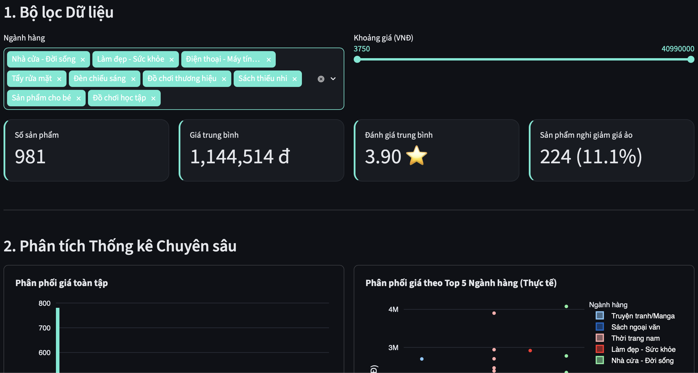
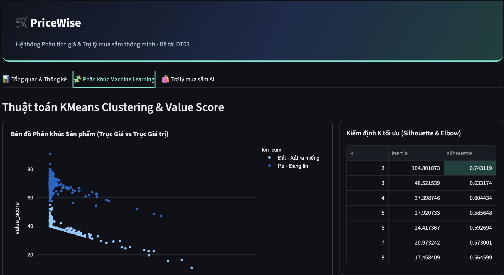
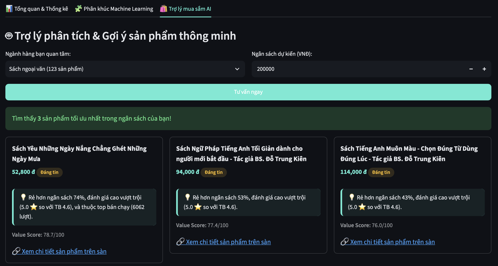

<div align="center">

# 🛒 PriceWise

### Hệ thống Phân tích giá & Trợ lý mua sắm thông minh cho sản phẩm thương mại điện tử

*Bài tập lớn cuối kỳ — Học phần Lập trình Python cho Phân tích Dữ liệu — Đề tài DT03*


</div>

---

## 📚 Mục lục

- [Giới thiệu](#-giới-thiệu)
- [Tính năng](#-tính-năng)
- [Giao diện](#-giao-diện)
- [Nguồn dữ liệu](#-nguồn-dữ-liệu)
- [Công nghệ sử dụng](#-công-nghệ-sử-dụng)
- [Cấu trúc thư mục](#-cấu-trúc-thư-mục)
- [Cài đặt & Chạy thử](#-cài-đặt--chạy-thử)
- [Đội ngũ phát triển](#-đội-ngũ-phát-triển)

---

## ✨ Giới thiệu

**PriceWise** phân tích dữ liệu giá sản phẩm thương mại điện tử thực tế thu thập từ Tiki, và cung cấp một trợ lý mua sắm thông minh — không chỉ hiển thị biểu đồ, mà còn đưa ra đánh giá và gợi ý sản phẩm phù hợp kèm link thật, dựa trên dữ liệu đã thu thập và phân tích.

> 💡 Không chỉ là một bảng thống kê — PriceWise giúp người dùng *ra quyết định mua hàng* dựa trên dữ liệu thật.

---

## 🎯 Tính năng

<table>
<tr>
<td width="33%" valign="top">

### 📊 Tổng quan & Thống kê

- Bộ lọc theo ngành hàng & khoảng giá
- KPI: số sản phẩm, giá TB, đánh giá TB, tỷ lệ nghi giảm giá ảo
- 6 biểu đồ phân tích chuyên sâu: phân phối giá, tương quan, kiểm định thống kê, top bán chạy, tỷ trọng ngành hàng, giảm giá ảo

</td>
<td width="33%" valign="top">

### 🧩 Phân khúc Machine Learning

- Phân cụm KMeans theo giá, đánh giá, lượt bán, % giảm giá
- Tự động chọn số cụm tối ưu (Elbow + Silhouette)
- Bản đồ trực quan các phân khúc sản phẩm
- "Chân dung" từng phân khúc: Hời / Tầm trung / Đắt

</td>
<td width="33%" valign="top">

### 🛍️ Trợ lý mua sắm AI

- Nhập ngành hàng + ngân sách dự kiến
- Gợi ý top sản phẩm phù hợp nhất kèm lý do cụ thể
- So sánh với mức giá, đánh giá, lượt bán trung bình
- Link trực tiếp đến sản phẩm thật

</td>
</tr>
</table>

---

## 📸 Giao diện

<div align="center">

**Tổng quan & Thống kê**


**Phân khúc Machine Learning**


**Trợ lý mua sắm AI**


</div>

---

## 🗂️ Nguồn dữ liệu

Dữ liệu được thu thập trực tiếp từ **Tiki** thông qua API công khai, bao gồm nhiều ngành hàng khác nhau: Sách, Thời trang, Điện thoại - Máy tính bảng, Làm đẹp - Sức khỏe, Nhà cửa - Đời sống...

---

## 🛠️ Công nghệ sử dụng

| Thành phần | Công nghệ |
|:---|:---|
| 🧮 Xử lý dữ liệu | Python · Pandas · NumPy |
| 📈 Thống kê | SciPy |
| 🤖 Machine Learning | scikit-learn (KMeans) |
| 📊 Trực quan hóa | Plotly |
| 🖥️ Giao diện web | Streamlit |

---

## 📁 Cấu trúc thư mục

```
Price_Wise/
├── data/                    # Dữ liệu đã thu thập và làm sạch
├── docs/                    # Báo cáo chất lượng dữ liệu
├── src/
│   ├── data_engineering.py  # Thu thập & làm sạch dữ liệu
│   ├── data_analysis.py     # Phân tích thống kê
│   └── machine_learning.py  # Value score & phân cụm KMeans
├── .streamlit/
│   └── config.toml          # Cấu hình giao diện
├── web.py                   # Ứng dụng Streamlit chính
├── requirements.txt
└── README.md
```

---

## 🚀 Cài đặt & Chạy thử

**1️⃣ Clone dự án và di chuyển vào thư mục**
```bash
git clone <đường-dẫn-repo>
cd Price_Wise
```

**2️⃣ Tạo và kích hoạt môi trường ảo**
```bash
python3 -m venv venv
source venv/bin/activate      # macOS/Linux
venv\Scripts\activate         # Windows
```

**3️⃣ Cài đặt thư viện cần thiết**
```bash
pip install -r requirements.txt
```

**4️⃣ Chạy ứng dụng**
```bash
streamlit run web.py
```

Ứng dụng sẽ mở tại **http://localhost:8501** 🎉

> 💡 **Mẹo:** muốn thu thập lại dữ liệu mới nhất từ Tiki, chạy thêm lệnh sau trước khi khởi động ứng dụng:
> ```bash
> cd src && python3 data_engineering.py
> ```

---

## 👥 Đội ngũ phát triển

| Vai trò | Phụ trách |
|:---|:---|
| 🔧 Data Engineer | Thu thập & làm sạch dữ liệu |
| 📊 Data Analyst | Phân tích thống kê |
| 🤖 ML Engineer | Value score & phân cụm KMeans |
| 🎨 Product / Dashboard Lead | Giao diện Streamlit & tích hợp hệ thống |

---

<div align="center">

*Đồ án môn học — không sử dụng cho mục đích thương mại* 🎓

</div>
